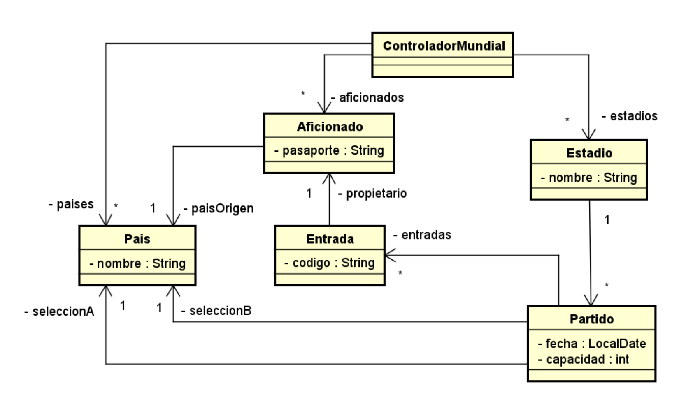

# Segundo Parcial Programacion II Mock 2022
### Tomás Bordaberry

- Object oriented programing midterm for programación II course in Universidad de Montevideo.
- Exam consisted of building a ticket manager for Qatar world cup. 

## UML Diagram

## Methods
The following were the method descriptions in the exam, translated to English:
1. `void registrarPartido(LocalDate fecha, String nombreEstadio, int capacidadHabilitada, String equipoPaisA, String equipoPaisB)`
  - A match must be registered for the indicated date, stadium, enabled stadium capacity, and involved teams.
  - In this operation, if they do not exist, instances of Stadium and Country must be created. Remember that only one match is played per day in a stadium.
  - Throws the exception InformacionInvalida if any mandatory data is null or if a match already exists for that date.

2. `void venderEntrada(String pasaporteAficionado, String paisOrigen, LocalDate partidoFecha, String nombreEstadio) `
  - This operation registers the purchase of a ticket by a fan from a certain country of origin, for a match on a certain date that is played in a certain stadium.
  - If the fan does not exist, they must be created.
  - The specified controls at the beginning of the description must be carried out, and the entry code must be returned according to the specified strategy.
  - Throws InformacionInvalida if any data is null.
  - Throws EntidadNoExiste if there is no match on the indicated date in the specified stadium.
  - Throws CompraRechazada if the fan does not meet the restrictions to make the purchase, including exceeding the enabled capacity.
    
3.`void traspasoEntrada(String pasaporteAficionado, String pasaporteAficionadoDestino, String paisOrigenAficionadoDestino, String codigoEntrada)`

  - This operation registers the transfer of a ticket from one fan to another.
  - This operation should remove the ticket identified by ticketCode from the stadium and create a new one in the same way as in the previous operation.
  - Consider calling the previous operation. It must be checked that the ticket corresponds to the fan and does not exceed the maximum number of transfers.
  - Throws InformacionInvalida if any data is null.
  - Throws EntidadNoExiste if there is no match on the indicated date in the specified stadium.
  - Throws CompraRechazada if the fan does not meet the restrictions to make the purchase.

4. `MyList<Aficionado> buscarAficionadosSospechosos()`
   
   - It is desired to search for fans who have purchased more than 5 tickets, none of which involve the fan's country of origin.
   - The list must be returned in ascending order by passport number.

## Auxiliar Methods

The `ControladorMundialImp` class also contains several auxiliary methods that support the main functionality. Here's a description of these methods:

1. `LocalAChrono(LocalDate fecha)`: This method takes a `LocalDate` object representing a date and converts it into a `ChronoLocalDate` object using the `IsoChronology` chronology. It is used to make the date comparable for certain operations.

2. `GenerarCodigo(Aficionado aficionado, LocalDate fecha, Estadio estadio)`: This method generates a unique code for an entry/ticket based on the fan's passport, the match date, and the stadium name. It concatenates these values with a delimiter "|" to create a code.

3. `CrearODevolverAficionado(String pasaporte, String paisOrigen) throws EntidadNoExiste`: This method creates or retrieves an existing fan (Aficionado) based on their passport and country of origin. If the fan already exists in the system, it is retrieved from the `aficionados` hash table. Otherwise, a new fan is created and added to the hash table.

4. `paisesEntrada(Entrada entrada)`: This method retrieves the participating countries in a match based on the code of the ticket/entry. It retrieves the corresponding match from the `estadios` hash table using the stadium name and match date extracted from the entry code. Then, it retrieves the participating countries from the match object and returns them as a list.

These auxiliary methods are used internally within the main methods to perform specific operations and help maintain the integrity of the data structures used in the `ControladorMundialImp` class.
